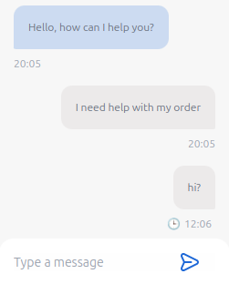

# React UI Chat - (IN DEVELOPMENT, DO NOT USE, YET)

React UI Chat is a customizable chat component for React applications. It provides a simple and elegant interface for building chat features in your web projects.



## Features

- 📝 Easy-to-use chat interface.
- 🎨 Customizable styling and theming.
- 📦 Lightweight and dependency-free.
- ⚙️ Extensible with plugins and hooks.

## Installation

You can install `react-ui-chat` via npm:

```bash
npm install react-ui-chat
```

## Usage

This is a basic example of how to use the `Chat` component:

```jsx
import { Chat } from 'react-ui-chat'
import "react-ui-chat/tailwind.css" // if you are not using tailwind
import { TMessage } from 'react-ui-chat/types' // if you are using typescript

const initialMessages: TMessage[] = [
  {
    id: 1,
    message: 'I need help with my order',
    date: new Date().toISOString(),
    type: "sent",
  },
  {
    id: 2,
    message: 'Hello, how can I help you?',
    date: new Date().toISOString(),
    type: "receive",
  },
]

const Example1 = () => <Chat initialMessages={initialMessages}/>

export default Example1
```

## Props
The `Chat` component accepts the following props:
* `initialMessages`: An array of messages to display when the chat is first rendered.
* `messages`: An array of messages to display in the chat. If this prop is provided, the chat will be controlled.
* `messageReceived`: A message object that was received. This prop is used to update the chat only with new messages.
* `onMessageSend`: A function that is called when the user sends a message. It receives the message object as an argument.

## Types
The `react-ui-chat` package exports the following types:
* `TMessage`: An object representing a chat message. It has the following main properties:
  * `id`: A unique identifier for the message.
  * `message`: The text content of the message.
  * `date`: The date and time when the message was sent.
  * `type`: The type of the message. It can be either "sent" or "receive".
  * `status`: The status of the message. It can be either "sending", "delivered", "read", or "error".

## Contributing

Contributions are welcome! Feel free to open issues or submit pull requests.

## License

This project is licensed under the MIT License - see the LICENSE file for details.
